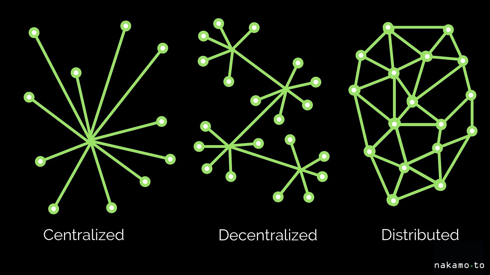

Dans cette section, on plonge plus en profondeur dans l'architecture de la blockchain.


L'achitecture de la blockchain, bien que dite décentralisée est en realité aussi distribuée. Cela signifie que chaque noeud du réseau possède une copie de la blockchain.



La blockchain est un registre public, ouvert et distribué, qui contient l'ensemble des transactions effectuées depuis sa création. Chaque transaction est validée par un consensus entre les noeuds du réseau, puis ajoutée à la blockchain sous forme de bloc.

La validité d'un bloc repose sous 4 facteurs:
- L'index du nouveau bloc doit être égal à l'index du dernier bloc + 1
- Le hash du bloc précédent doit être égal au hash stocké dans le bloc
- Le hash du bloc doit commencer par un certain nombre de zéros
- La preuve de travail doit être valide (la structure du block + le nonce hashé en sha256 doit correspondre au hash produit)

Voilà le contenu d'un bloc:

```json
{
  "index": 0,
  "timestamp": 1465154705,
  "transactions": [
    {
      "sender": "8527147fe1f5426f9dd545de4b27ee00",
      "recipient": "a77f5cdfa2934df3954a5c7c7da5df1f",
      "amount": 5,
    }
  ],
  "nonce": 324984774000,
  "previous_hash": "0000007a7a7a7a7a7a7a7a7a7a7a7a7a"
}
```

