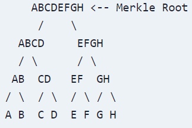

Cette section traite toujours du stockage des informations dans la Blockhain et ici tout particulièrement de la manière
dont les transactions sont stockées dans la Blockchain et au sein de son propre block.

Afin de faciliter la vérifications des transactions au sein d'un block, les transactions sont stockées dans un format hashé.

Cependant, elle ne sont pas hachées toutes ensembles directement mais dans un arbre de Merkle.



L'arbre de Merkle est un arbre binaire dans lequel chaque noeud est le hash de ses enfants. Ainsi, la racine de l'arbre est le hash de toutes les transactions.

L'arbre de Merkle est utilisé pour vérifier l'intégrité des transactions dans un block. En effet, si un seul bit d'une transaction est modifié, le hash de la transaction sera complètement différent. Ainsi, le hash de la racine de l'arbre de Merkle sera complètement différent.

Son utilité se trouve dans le fait que si un utilisateur veut vérifier une transaction dans un block, il n'a pas besoin de télécharger l'intégralité du block. Il lui suffit de télécharger l'arbre de Merkle et le hash de la transaction. Il pourra alors vérifier que la transaction est bien dans le block en vérifiant que le hash de la transaction est bien dans l'arbre de Merkle.

La vérification des données est également très rapide en ne nécessitant que O(log(n)) opérations.

Ainsi en reprenant l'image du dessus, si un utilisateur veut vérifier que D est bien présent dans le block, il n'aura besoin que de télécharger les hash de C, AB, EFGH Il pourra alors vérifier que le hash de D est bien présent dans l'arbre de Merkle.

> Le Merkle Tree root est stocké dans le header du block.

Voilà un exemple de code d'arbre de Merkle en JavaScript:

```javascript
class MerkleTree {
    constructor(leaves, concat) {
        this.leaves = leaves;
        this.concat = concat;
    }

    buildTree(layer) {
        const len = layer.length;
        const newLayer = [];

        if ( len == 1) {
            return layer[0];
        }
        for (let i = 0 ; i < len ; i += 2) {
            if(i  == len - 1) {
                break;
            }
            newLayer.push(this.concat(layer[i], layer[i + 1]))
        }
        if(len % 2 !== 0) {
            newLayer.push(layer[len - 1]);
        }

        return this.buildTree(newLayer);
    }

    buildProof(layer, idx, proof) {
        const len = layer.length
        const isLeft = idx % 2 == 0;

        if ( len == 1) {
            return proof;
        }

        if(isLeft) {
            if(idx + 1 < len) {
                proof.push({data: layer[idx + 1], left: false});
            }
        } else {
            proof.push({data: layer[idx - 1], left: true});
        }

        const newLayer = [];
        for (let i = 0 ; i < len ; i += 2) {
            if(i  == len - 1) {
                break;
            }
            newLayer.push(this.concat(layer[i], layer[i + 1]))
        }
        if(len % 2 !== 0) {
            newLayer.push(layer[len - 1]);
        }
        const newIdx = Math.floor(idx / 2);

        return this.buildProof(newLayer, newIdx, proof);
    }
    getProof (idx) {
        return this.buildProof(this.leaves, idx, []);
    }  
 
   getRoot() {
        return this.buildTree(this.leaves);
    }
}

module.exports = MerkleTree;
```
