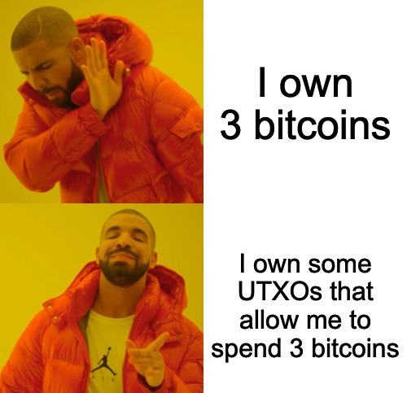

Dans ce cours nous avons appris comment sont stocker les données utilisateur dans la Blockchain

Il existe à ce jour 2 grandes méthodes pour stocker la balance des utilisateurs dans la Blockchain:
- La méthode UTXO (Unspent Transaction Output)
- La méthode Account Based

## UTXO

La méthode UTXO est la méthode utilisée par Bitcoin. Elle consiste à stocker la balance des utilisateurs dans des transactions non dépensées.

Les transactions sont composées de plusieurs inputs et outputs. Les inputs sont des références à des outputs de transactions précédentes. Les outputs sont des montants de cryptomonnaie qui sont envoyés à des adresses.

Lorsqu'un utilisateur veut envoyer de la cryptomonnaie, il doit référencer des outputs de transactions précédentes. Ces outputs sont alors dépensés et ne peuvent plus être utilisés. Les outputs qui ne sont pas dépensés sont appelés UTXO.

La balance d'un utilisateur est alors la somme de tous les UTXO qui lui appartiennent.

Ainsi, un utilisateur sur Bitcoin ne possède en soit `pas` de Bitcoin mais possède des UTXO qui lui permettent de dépenser des Bitcoin.

A savoir qu'un UTxO ne peut être divisé. Si un utilisateur possède un UTxO de 10 BTC et qu'il veut envoyer 5 BTC, il devra envoyer les 10 BTC et recevra 5 BTC en retour.

## Account Based

La méthode Account Based est la méthode utilisée par Ethereum. Elle consiste à stocker la balance des utilisateurs dans des comptes.

Chaque compte possède une adresse et une balance. Lorsqu'un utilisateur veut envoyer de la cryptomonnaie, il doit signer un message avec sa clé privée. Ce message est alors envoyé au réseau et est vérifié par les noeuds. Si le message est valide, la balance du compte est modifiée.

La balance d'un utilisateur est alors la balance de son compte.

Afin d'éviter les attaques de type "replay", Ethereum utilise un système de "nonce". Le nonce est un nombre qui est incrémenté à chaque transaction. Ainsi, une transaction ne peut être rejouée car le nonce sera différent.

## Utilité

Ces 2 méthodes ont des avantages et des inconvénients mais elles se rejoignent sur un point: elles permettent de stocker la balance des utilisateurs dans la Blockchain de manière sécurisée tout en offrant une solution fiable au casse-tête de tout système financier décentralisé: **la double dépense**.

La méthode UTXO est plus complexe à comprendre mais offre une meilleure confidentialité. En effet, il est difficile de savoir qui possède réellement un UTXO. De plus, elle permet de faire des transactions plus complexes.

La méthode Account Based est plus simple à comprendre et offre une meilleure extensibilité. En effet, il est plus facile de faire des requêtes sur les comptes que sur les UTXO.

Aujourd'hui, la méthode Account Based est la plus utilisée car elle est plus simple à comprendre et offre une meilleure extensibilité. Cependant, la méthode UTXO est toujours utilisée par Bitcoin et d'autres cryptomonnaies.

