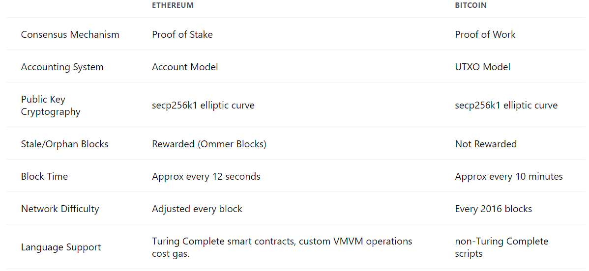

Cette lecon est une introduction à Ethereum ! 

Ethereum est une plateforme de blockchain open-source qui permet aux développeurs de construire et de déployer des applications décentralisées (dApps).
Ethereum a été proposé par Vitalik Buterin en 2013 et est devenu opérationnel en 2015.

La chose à comprendre, c'est que l'ordinateur Ethereum n'est pas vraiment rapide. En fait, l'exécution du code sur l'ordinateur Ethereum est de 5 à 100 fois plus lente que le code compilé typique sur d'autres machines. De plus, son utilisation est assez coûteuse ! Ajouter 5+5 est un calcul éclair même sur les téléphones... mais ajouter 5+5 sur Ethereum peut coûter quelques dollars. Fondamentalement, les coûts de calcul, de stockage et de mémoire de base de l'ordinateur Ethereum ressemblent à ceux d'un ordinateur des années 1950.


## Voici les caractéristiques d'Ethereum:
1. Ethereum = Singleton Mondial Véritable
Ethereum est peut-être le premier ordinateur singleton mondial jamais créé, qui n'est fondamentalement pas localisé (ce qui signifie qu'il n'est situé dans aucun emplacement unique). Tous les autres ordinateurs sont soit des machines physiques (ordinateurs portables) soit des machines virtuelles, qui résident dans des machines physiques.

Ethereum ne réside dans aucune machine unique, n'a aucune présence physique dans une partie du monde... pourtant, il n'y en a qu'un seul !

2. Résistance à la Censure
Aucune autorité, gouvernement ou société n'est derrière l'ordinateur Ethereum. Personne ne le possède, ne peut l'éteindre ou l'utiliser en tant qu'utilisateur avancé (c'est-à-dire un administrateur système dans une configuration client-serveur typique).

3. Ethereum = Ubiquitaire & Accessible
Où il y a Internet, il y a Ethereum. Il n'y a aucune barrière à la participation. Si vous pouvez vous connecter au WiFi, vous pouvez interagir avec l'ordinateur Ethereum. Si vous voulez écrire sur l'ordinateur Ethereum, vous aurez juste besoin de quelques ETH en plus d'une connexion Internet - pour payer les frais de gaz ! Ainsi, l'ordinateur Ethereum est omniprésent (partout !).

En termes d'accessibilité, le principal langage de programmation des contrats intelligents d'Ethereum est actuellement Solidity - un langage avec de fortes similitudes de conception avec JavaScript. JS est le langage de programmation qui alimente Internet. Par conséquent, la courbe d'apprentissage pour les nouveaux développeurs Ethereum n'est pas particulièrement difficile - elle est très similaire au langage de programmation le plus populaire sur la planète. Cela signifie que l'ordinateur Ethereum n'est pas caché derrière des couches de complexité, il est accessible, pour commencer, à quiconque connaît (ou apprend !) JavaScript.

4. Ethereum = Nativement Multi-Utilisateurs
L'ordinateur Ethereum, grâce à la large plage d'entrée de la fonction de hachage keccak256, a une plage pratiquement infinie de création de comptes possible. La plage est de 2^160, un nombre tellement incroyablement grand que nos cerveaux humains chétifs ne peuvent même pas le comprendre.

Fondamentalement, l'ordinateur Ethereum peut fournir autant de comptes que nous en aurons jamais besoin - et plus encore. Essayez de créer un nouveau compte maintenant, c'est facile comme tout !

5. Ethereum est Vérifiable & Auditable
Tout code déployé sur l'ordinateur Ethereum est honoré maintenant et pour toujours. Les contrats intelligents héritent des propriétés cryptographiques de l'ordinateur Ethereum : immuabilité, résistance à la censure et vérifiabilité. Une fois que vous déployez un contrat intelligent, à moins que vous ne codiez explicitement une clause avec un appel à selfdestruct, ce contrat vivra sur l'ordinateur Ethereum POUR TOUJOURS. Personne ne peut le changer, pas même Vitalik.


## Alors... Pourquoi Ethereum ?
La plateforme Ethereum permet aux développeurs de construire de puissantes applications décentralisées avec des fonctions économiques intégrées, tout en offrant une disponibilité élevée, une transparence et une neutralité.

L'objectif d'Ethereum n'est pas d'être rapide ou bon marché, mais d'être fiable. Tout programme exécuté sur l'ordinateur Ethereum est garanti de fonctionner de la même manière partout, sur chaque nœud. Les données stockées sur l'ordinateur Ethereum sont disponibles partout et sont permanentes. Ça, c'est un ordinateur cool !


## Différences entre Ethereum et Bitcoin



Et d'autres différences : 
- Bitcoin est une blockchain de paiement, tandis qu'Ethereum est une blockchain de contrat intelligent.
- Bitcoin utilise un langage de script simple, tandis qu'Ethereum utilise un langage de script Turing complet.
- Bitcoin a un temps de blocage de 10 minutes, tandis qu'Ethereum a un temps de blocage de 15 secondes.
- Bitcoin utilise un algorithme de consensus de preuve de travail, tandis qu'Ethereum utilise un algorithme de consensus de preuve de participation.

## Frais de gas

Les frais de gaz sont les frais que les utilisateurs paient pour effectuer des transactions ou exécuter des contrats intelligents sur la blockchain Ethereum. Les frais de gaz sont basés sur la complexité de la transaction ou du contrat intelligent et sont payés en ETH.

Cette notion existe afin d'éviter les attaques de déni de service sur le réseau Ethereum. Les attaques de déni de service sont des attaques qui visent à rendre un réseau indisponible pour ses utilisateurs légitimes en surchargeant le réseau de transactions non valides.

Par exemple, 

```solidity
pragma solidity ^0.4.0;

contract SimpleStorage {

    constructor() public {
        while (true) {
            // Infinite loop
        }
    }
}
```

Ce contrat intelligent est un exemple de contrat qui coûterait beaucoup de gaz pour être exécuté. En fait, il coûterait tellement de gaz que la transaction ne serait probablement jamais confirmée.

La boucle infinie dans le constructeur de ce contrat intelligent est une attaque de déni de service potentielle. Cependant grâce au calcul des frais de gaz, cette attaque est évitée car l'attaquant devrait payer un prix exorbitant pour exécuter cette transaction.

Les frais de gaz sont calculés en multipliant le prix du gaz par la quantité de gaz utilisée. Le prix du gaz est déterminé par le marché et est exprimé en gwei. 1 gwei est égal à 0.000000001 ETH.

## Forks

Ethereum embrasse la nouveauté et l'innovation. Cela signifie que le protocole Ethereum est en constante évolution. Ces changements sont appelés des **forks**.

Voici les deux types de forks les plus courants :
- **Hard Fork** : Un hard fork est un changement radical et non rétrocompatible du protocole Ethereum. Cela signifie que les nœuds qui ne mettent pas à jour leur logiciel ne pourront pas participer au réseau Ethereum. Les hard forks sont généralement utilisés pour ajouter de nouvelles fonctionnalités au protocole Ethereum.
- **Soft Fork** : Un soft fork est un changement rétrocompatible du protocole Ethereum. Cela signifie que les nœuds qui ne mettent pas à jour leur logiciel pourront toujours participer au réseau Ethereum.

Les forks sont souvent utilisés pour résoudre des problèmes de sécurité ou pour ajouter de nouvelles fonctionnalités au protocole Ethereum.

Ils sont proposés par les développeurs Ethereum et sont ensuite votés par les mineurs Ethereum. Si un fork est accepté par la majorité des mineurs, il est activé sur le réseau Ethereum.

Ces propositions sont sous forme de papiers de recherche appelés Ethereum Improvement Proposals (EIP)

Il existe également un second type de proposition appelé Ethereum Request for Comments (ERC). Les ERC sont des propositions de normes pour les contrats intelligents Ethereum.

Par exemple le token ERC-20 est un standard pour les contrats intelligents Ethereum qui permet de créer des jetons sur la blockchain Ethereum.
L'ERC 721 est un standard pour les contrats intelligents Ethereum qui permet de créer des jetons non fongibles sur la blockchain Ethereum. (NFT)
etc...


# Proof Of Stake 

Le Proof Of Stake est la deuxième méthode de consensus la plus utilisée dans les blockchains. Il est utilisé par des blockchains comme Ethereum, Cardano, Tezos, Cosmos, Polkadot, Algorand, etc.

Le Proof Of Stake est une méthode de consensus qui permet de valider les transactions et de créer de nouveaux blocs. Contrairement au Proof Of Work, le Proof Of Stake ne nécessite pas de puissance de calcul pour valider les transactions et créer de nouveaux blocs. Il est basé sur la détention de cryptomonnaies.

En effet, ici aulieu de faire la course pour résoudre un problème mathématique, les validateurs sont choisis aléatoirement en fonction du nombre de cryptomonnaies qu'ils détiennent. Plus un validateur possède de cryptomonnaies, plus il a de chances d'être choisi pour valider les transactions et créer de nouveaux blocs.

De base, l'utilisateur doit stacker un minimum de 32 ETH pour devenir validateur. Cependant, il est possible de devenir validateur en passant par des pools de staking. Ces pools permettent de stacker des cryptomonnaies avec d'autres utilisateurs pour augmenter les chances d'être choisi comme validateur.

Le Proof Of Stake est une méthode de consensus qui est plus écologique que le Proof Of Work. En effet, il ne nécessite pas de puissance de calcul pour valider les transactions et créer de nouveaux blocs. Cependant, il est possible de faire des attaques de 51% sur certaines blockchains en utilisant le Proof Of Stake. C'est pour cela que certaines blockchains utilisent des mécanismes de sécurité supplémentaires pour éviter les attaques de 51%.


# Gas