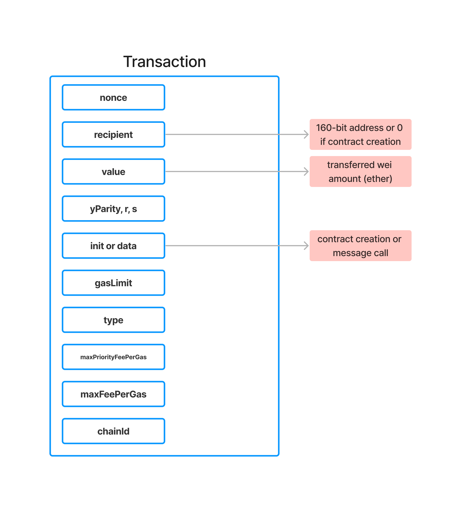
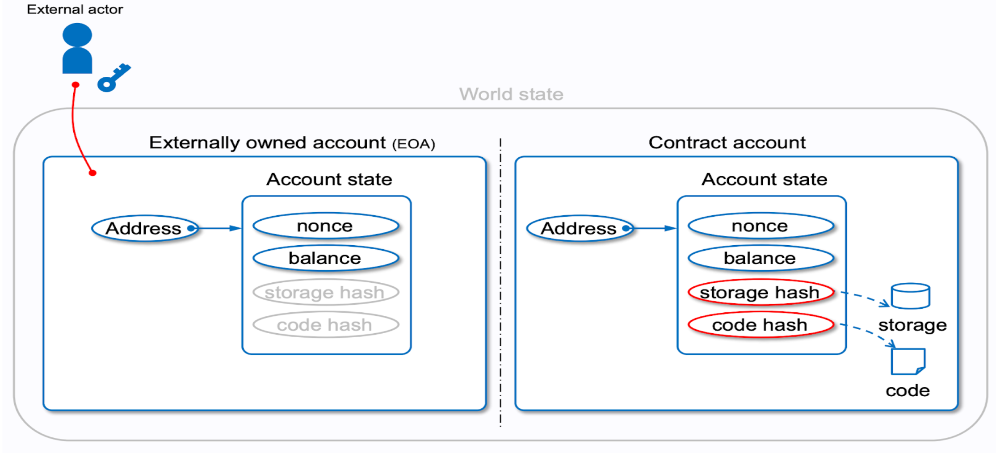
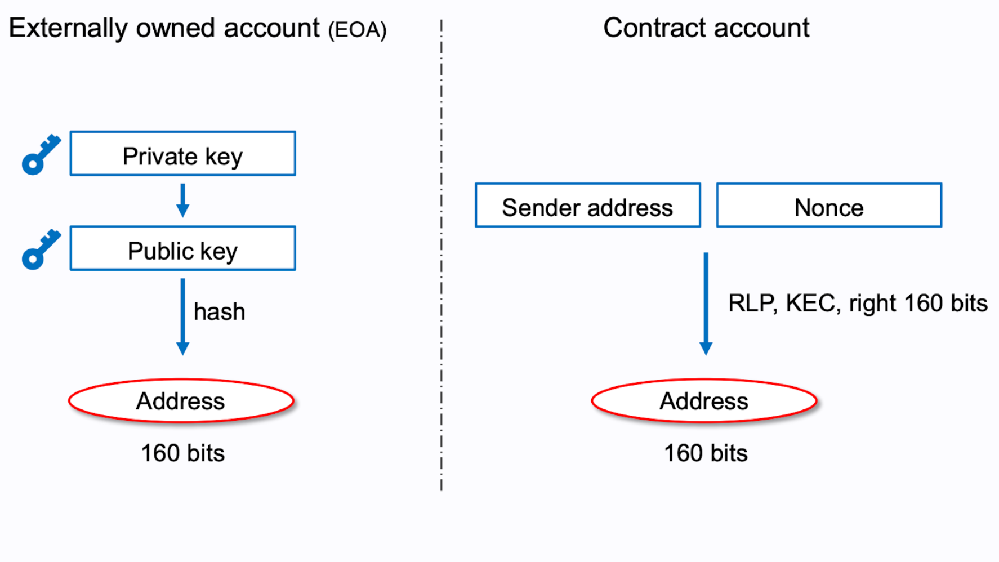
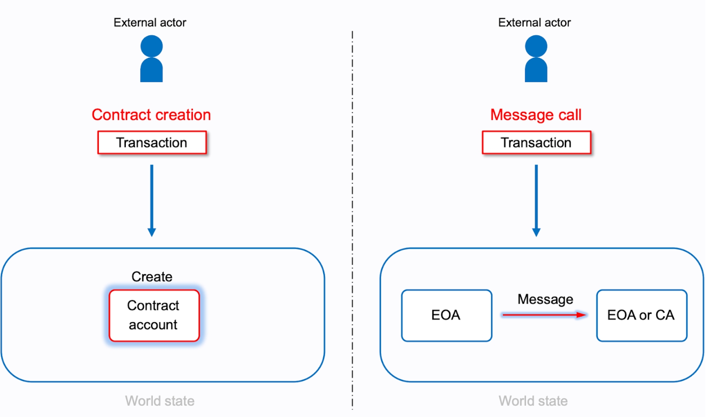
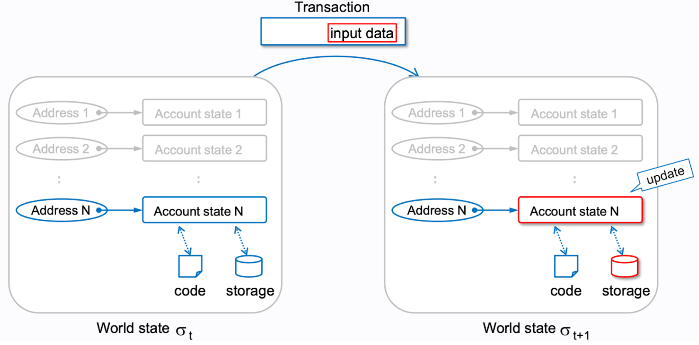
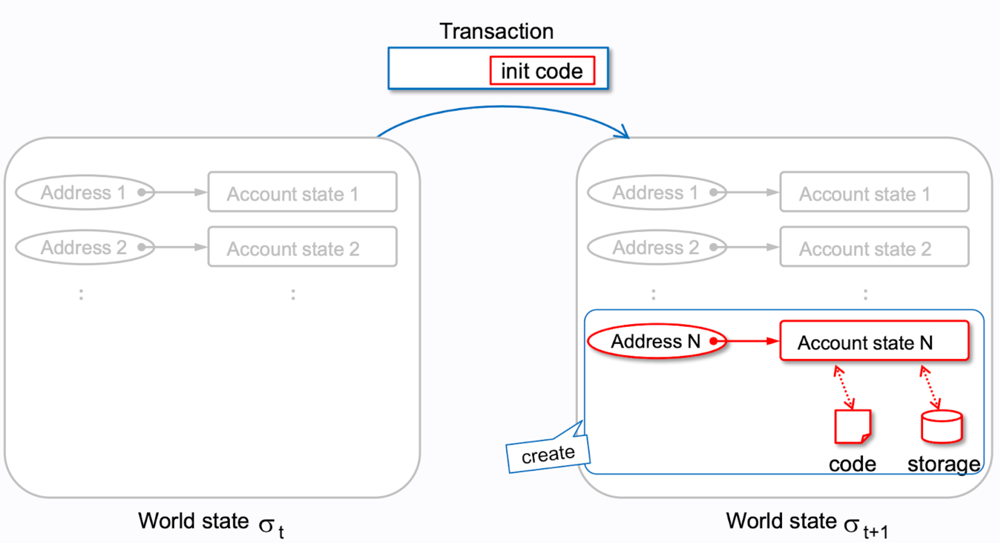
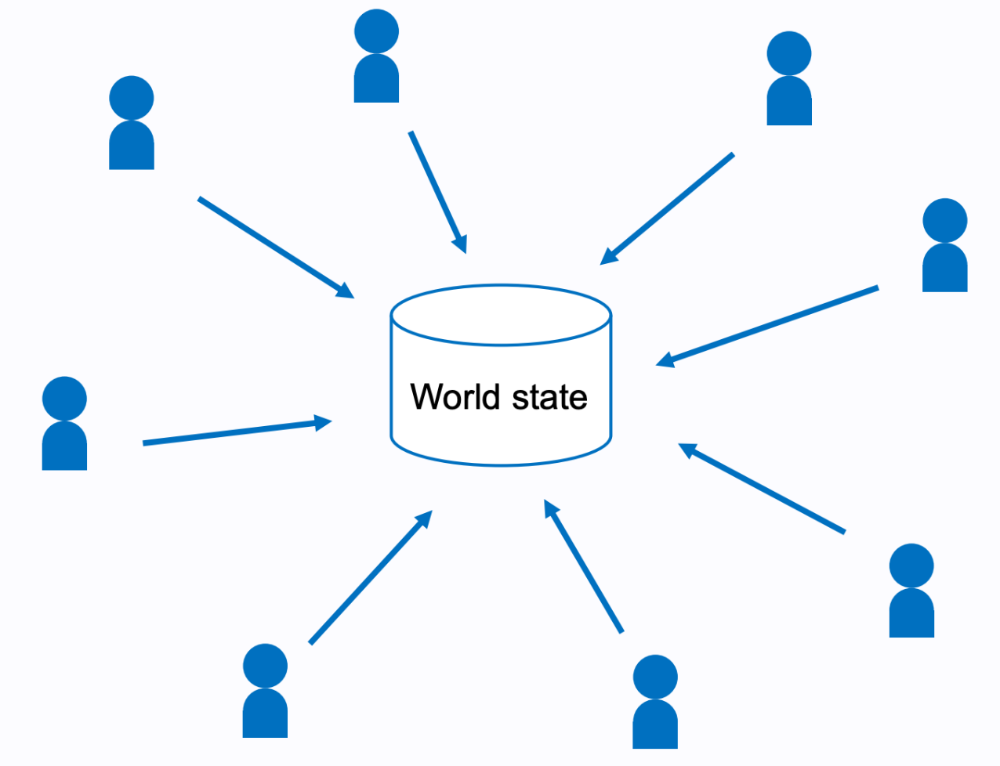
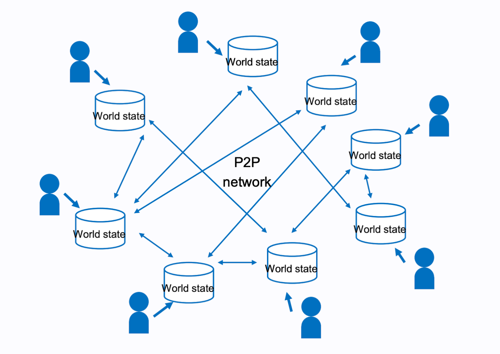

Une transaction sous Ethereum est une opération effectuée par un EOA permettant d'effectuer une action quelquonque. Cette dernière venant alors modifier le Global State de la blockchain.

Une transaction est composée de plusieurs éléments:
- **Nonce**: Nombre entier qui permet de garantir l'unicité de la transaction. Il est incrémenté à chaque transaction effectuée par un EOA.
- **Recipient**: Adresse du destinataire de la transaction.
- **value**: Montant de Wei à envoyer au destinataire.
- **yParity, r, s**: Signature de la transaction.
- **init / data**: Données supplémentaires à envoyer au destinataire. (Pour les contrats, il s'agit du bytecode du contrat à déployer)
- **gasLimit**: Limite de gas pouvant être utilisée pour la transaction.
- **type**: Type de transaction (0x0 pour une transaction normale, 0x2 pour une transaction de type EIP-1559)
- **Max priority fee per gas**: Prix maximum que l'expéditeur est prêt à payer en pourboire pour chaque unité de gas.
- **Max fee per gas**: Prix maximum que l'expéditeur est prêt à payer pour chaque unité de gas.
- **Chain ID**: Identifiant de la chaîne sur laquelle la transaction est effectuée.

Une transaction est signée par l'expéditeur à l'aide de sa clé privée. Cette signature permet de garantir l'authenticité de la transaction et de garantir que l'expéditeur est bien celui qu'il prétend être.

> "A transaction is a single cryptographically-signed instruction. It is a signal of intent from an owner of a private key that they want to change the Ethereum state in one way or another."




# Différence entre EOA et Contrat



## Comment sont définies les adresses des comptes ?

Les adresses des comptes sont définies à partir de la clé publique de l'EOA ou du contrat. La clé publique est hachée à l'aide de l'algorithme Keccak-256 puis les 20 derniers octets du hash sont utilisés pour définir l'adresse de l'EOA ou du contrat.
> La clé publique venant elle même de la clé privée de l'EOA ou du contrat.

## Comment sont définies les adresses des contrats ?

L'address d'un contrat est définie à partir de l'adresse de l'entité ayant déployé le contrat et du nonce de ce dernier. L'adresse du contrat est alors définie à partir de la clé publique de l'EOA et du nonce du contrat.

> CREATE2 est une nouvelle instruction permettant notamment de définir l'adresse d'un contrat avant même de le déployer. L'address du contrat est alors définie à partir de l'adresse du code du contrat.

```solidity

function getAddress(bytes32 salt, bytes32 bytecodeHash) public view returns (address) {
    return address(uint160(uint(keccak256(abi.encodePacked(
        byte(0xff),
        address(this),
        salt,
        keccak256(abi.encodePacked(bytecodeHash))
    )))));
}

```



# Deux types de transactions

Il existe deux types de transactions sous Ethereum:



## 1. Message Call

Une transaction initiée par un EOA qui appelle une fonction d'un contrat. Cette transaction n'ajoute pas de nouvelle entrée dans le Global State de la blockchain.
> Le message call peut cependant avoir pour effet de bord de modifier le state du contrat, mais pas de la blockchain.



## 2. Contract Creation

Une transaction de type Contract Creation est une transaction qui permet de déployer un nouveau contrat sur la blockchain. Elle est utilisée pour déployer un nouveau contrat sur la blockchain.




# Un monde de transactions



Mais plutôt comme ça:



# Exemples de transactions

## Alice envoie 1 ETH à Bob

```json

{
  to: "0x2c8645BFE28BEEb6E19843eE9573b7539DD5B530", // Bob
  gasLimit: "21000",
  maxFeePerGas: "30", // 28 (base) + 2 (priorityFee)
  maxPriorityFeePerGas: "2", // minerTip
  nonce: "0",
  value: "100000000000000000", // 1 ether worth of wei
  data: '0x', // no data, we are not interacting with a contract
  type: 2, // this is not a legacy tx
  chainId: 4, // this is AU, we deal only in test networks! (Göerli)    
}
    
```

## Alice appelle la fonction d'un contrat

```json

{
  to: "0xEA674fdDe714fd979de3EdF0F56AA9716B898ec8", // smart contract address
  gasLimit: "36000",
  maxFeePerGas: "30", // 28 (base) + 2 (priorityFee)
  maxPriorityFeePerGas: "2", // minerTip
  nonce: "1", // this is Alice's second transaction, so the nonce has increased!
  value: "100000000000000000", // 1 ether worth of wei
  data: '0x7362377b0000000000000000000000000000000000000000000000000000000000000000', // this calldata tells the EVM what function to execute on the contract, contains parameter values here as well
  type: 2, // this is not a legacy tx
  chainId: 4, // this is AU, we deal only in test networks! (Göerli)    
}
    
```

### Comment savoir quelle data envoyer ?

La data est définie à partir de la signature de la fonction que l'on souhaite appeler. Cette signature est définie à partir du nom de la fonction et des types de ses paramètres.

```solidity

function transfer(address to, uint256 amount) public returns (bool) {
    // ...
}

```

La signature de la fonction transfer est alors définie à partir de son nom et des types de ses paramètres.

```solidity

keccak256("transfer(address,uint256)") // 0xa9059cbb

```

On récupère alors les 4 premiers octets de la signature de la fonction pour définir la data à envoyer.
Puis on pad avec des zéros les paramètres de la fonction.

```json

{
  data: '0xa9059cbb000000000000000000000000'
}
```
