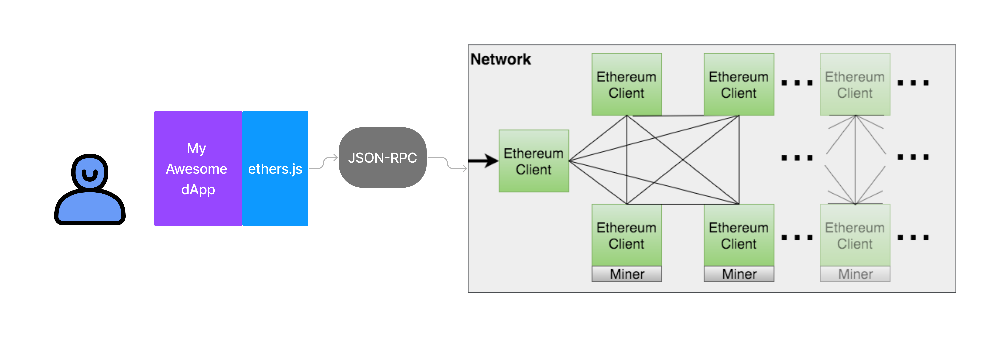

Il existe 2 librairies principales pour le front-end d'une application Ethereum:
- Web3.js
- Ethers.js

## La meilleure librairie pour le front-end

La meilleure librairie pour le front-end est `Ethers.js`. Elle est plus moderne, plus simple et plus performante que `Web3.js`.
Elle fait globalement absolument tout ce que fait `Web3.js` mais avec des choses en plus.
- Plus de fonctionnalités
- Plus de sécurité (10k tests)
- Plus de légère (1/3 de la taille de `Web3.js`)

## Ethers.js

Ethers.js est une librairie JavaScript qui permet de se connecter à une blockchain Ethereum. Elle permet de:
- Se connecter à un noeud Ethereum
- Gérer des clés privées
- Gérer des transactions
- Gérer des contrats
- Gérer des événements
- Gérer des tokens
- Gérer des signatures
- etc...

Cela passe par 3 grandes catégories de classes:
- `Providers`: pour se connecter à un noeud Ethereum
- `Wallet`: Pour gérer le compte Ethereum
- `Contract`: Pour gérer les contrats Ethereum

> npm install ethers

