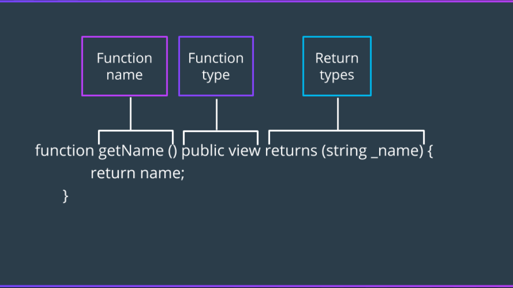

Les fonctions en Solidity sont déclarées en spécifiant le mot clé `function`, suivi du nom de la fonction, des paramètres de la fonction, des modificateurs de visibilité et du type de données de retour. Voici un exemple de déclaration de fonction :

```solidity
function myFunction() public returns (uint256) {
    // Function code
    return 123;
}
```




# Modificateurs de visibilité

Le mot clé `public` est un modificateur de visibilité qui permet à la fonction d'être appelée de l'intérieur et de l'extérieur du contrat.


Il existe plusieurs modificateurs de visibilité en Solidity :
| Modifier | Description |
| ---      | ----------- |
| `public` | La fonction peut être appelée de l'intérieur et de l'extérieur du contrat. |
| `private` | La fonction ne peut être appelée que de l'intérieur du contrat. |
| `internal` | La fonction ne peut être appelée que de l'intérieur du contrat et des contrats qui héritent de ce contrat. |
| `external` | La fonction ne peut être appelée que de l'extérieur du contrat. |

Les fonctions en Solidity peuvent également être déclarées avec des modificateurs. Les modificateurs sont des morceaux de code qui peuvent être réutilisés dans plusieurs fonctions. Ils sont utilisés pour modifier le comportement d'une fonction sans avoir à répéter le code. Voici un exemple de déclaration de fonction avec un modificateur :

```solidity

modifier onlyOwner() {
    require(msg.sender == owner);
    _;
}

function myFunction() public onlyOwner {
    // Function code
}
```

# Modificateurs de fonctionnement
Aussi, une fonction en Solidity peut avoir des modificateurs de fonctionnement. Une fonction peut être déclarée comme `payable` si elle accepte des paiements en ETH. Voici un exemple de déclaration de fonction `payable` :

```solidity

function myFunction() public payable {
    // Function code
}
```

Voici une liste exhaustive des modificateurs de fonctionnement en Solidity :

| Modificateur | Description |
| ---          | ----------- |
| `pure`       | La fonction ne lit pas l'état du contrat. |
| `view`       | La fonction lit l'état du contrat mais ne le modifie pas. |
| `payable`    | La fonction accepte des paiements en ETH. |


# Returns

Les fonctions en Solidity peuvent retourner des valeurs. Voici un exemple de fonction qui retourne une valeur :

```solidity

function myFunction() public returns (uint256) {
    return 123;
}
```

Un autre moyen permet de renvoyer une valeur sans utiliser le mot clé `return` :

```solidity

function myFunction() public returns (uint256 myNumber) {
    myNumber = 123;
}
```

Dans cet exemple, `myNumber` est une variable de stockage qui stocke la valeur retournée par la fonction.

Les fonctions en Solidity peuvent également retourner plusieurs valeurs. Voici un exemple de fonction qui retourne plusieurs valeurs :

```solidity

function myFunction() public returns (uint256, uint256) {
    return (123, 456);
}
```

Dans cet exemple, la fonction retourne deux valeurs : `123` et `456`.


