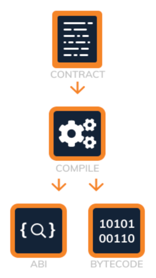

# Smart Contract Communication

Une fois notre smart contract compilé, celui-ci va générer 2 fichiers : un fichier ABI et un fichier binaire (bytecode). Ces fichiers vont nous permettre de communiquer avec notre smart contract.

## ABI

L'ABI (Application Binary Interface) est un fichier JSON qui définit les méthodes et les événements d'un smart contract. Il est utilisé pour communiquer avec le smart contract depuis une application externe. Cela permet alors de savoir comment interagir avec le smart contract (autocompletion, types de données, etc...).

## Bytecode

Le bytecode est le code qui est exécuté par l'Ethereum Virtual Machine (EVM). Il est généré à partir du code source Solidity à l'aide d'un compilateur Solidity.

Il existe 2 types de bytecode :
- `Creation Bytecode` : c'est le bytecode qui est exécuté lorsqu'un smart contract est déployé sur la blockchain. (Avec le constructeur)
- `Run time Bytecode` : c'est le bytecode qui est exécuté lorsqu'une méthode est appelée sur le smart contract. (Sans le constructeur)



# Exemples

## Code source Solidity

```solidity
// SPDX-Licence-Identifier: MIT
pragma solidity 0.8.4;

contract Counter {
    uint public count;

    // Function to get the current count
    function get() public view returns (uint) {
        return count;
    }

    // Function to increment count by 1
    function inc() public {
        count += 1;
    }

    // Function to decrement count by 1
    function dec() public {
        // This function will fail if count = 0
        count -= 1;
    }
}
```

## ABI Généré

```json
[
	{
		"inputs": [],
		"name": "count",
		"outputs": [
			{
				"internalType": "uint256",
				"name": "",
				"type": "uint256"
			}
		],
		"stateMutability": "view",
		"type": "function"
	},
	{
		"inputs": [],
		"name": "dec",
		"outputs": [],
		"stateMutability": "nonpayable",
		"type": "function"
	},
	{
		"inputs": [],
		"name": "get",
		"outputs": [
			{
				"internalType": "uint256",
				"name": "",
				"type": "uint256"
			}
		],
		"stateMutability": "view",
		"type": "function"
	},
	{
		"inputs": [],
		"name": "inc",
		"outputs": [],
		"stateMutability": "nonpayable",
		"type": "function"
	}
]
```
