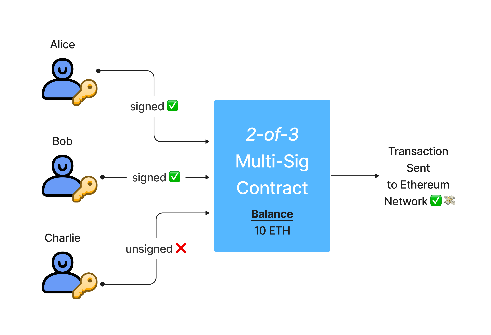

Les contrat multi-signatures sont des contrats qui permettent à plusieurs utilisateurs de signer une transaction avant qu'elle ne soit exécutée. Cela permet de sécuriser les fonds en cas de perte de clé privée ou de vol. Les contrats multi-signatures sont souvent utilisés pour sécuriser les fonds des ICOs, des exchanges ou des portefeuilles de fonds.

## EOA classique


## Multi-Sig




Cette répartitions des signatures offre une sécurité supplémentaire. En effet, si un des signataires perd sa clé privée, les fonds ne sont pas perdus. De plus, si un des signataires est corrompu, il ne peut pas voler les fonds. Enfin, si un des signataires est indisponible, les autres signataires peuvent toujours signer la transaction, etc...


## L'utilisation des contrats multi-signatures

Les contrats multi-signatures sont particulièrement utiles dans ces cas:

- Les ICOs: les fonds sont sécurisés par plusieurs signataires
- Les exchanges: les fonds sont sécurisés par plusieurs signataires
- Une famille: les fonds sont sécurisés par plusieurs signataires
- Une Entreprise: les fonds sont sécurisés par plusieurs signataires
## Exemple de contrat multi-signature

```solidity

pragma solidity ^0.4.24;

contract MultiSigWallet {
    address private _owner;
    mapping(address => uint8) private _owners;
    
    modifier isOwner() {
        require(msg.sender == _owner);
        _;
    }
    
    modifier validOwner() {
        require(msg.sender == _owner || _owners[msg.sender] == 1);
        _;
    }
    
    event DepositFunds(address from, uint amount);
    event WithdrawFunds(address to, uint amount);
    event TransferFunds(address to, uint amount);
    
    constructor() public {
        _owner = msg.sender;
    }
    
    function addOwner(address owner) isOwner public {
        _owners[owner] = 1;
    }
    
    function removeOwner(address owner) isOwner public {
        _owners[owner] = 0;
    }
    
    receive() external payable {
        emit DepositFunds(msg.sender, msg.value);
    }
...
}
```

