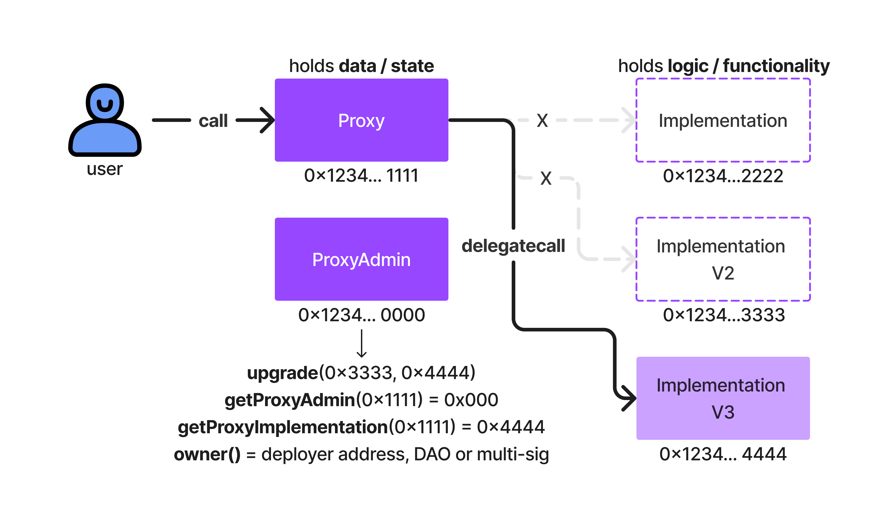

Les contrats améliorables sont un pattern de conception qui permet de mettre à jour un contrat sans perdre son historique ou ses données. Ils sont utilisés pour améliorer la flexibilité et la maintenance des contrats intelligents.

Voici un schéma de base pour un contrat améliorable :

C'est globalement un fonctionnement d'un contract implémentation et de 2 contrats proxy. Le contrat implémentation est le contrat qui contient la logique métier du contrat. Les contrats proxy sont des contrats qui délèguent les appels à l'implémentation.