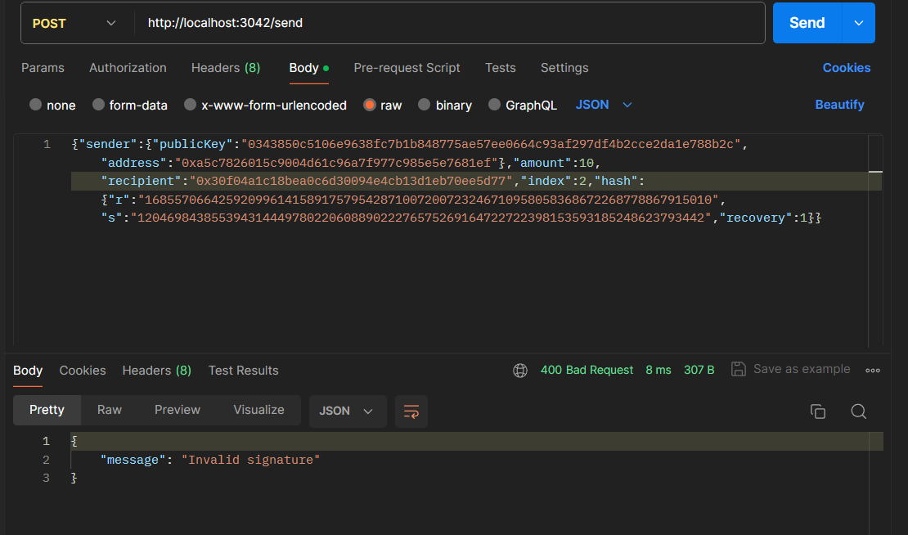

## ECDSA Node

This project is an example of using a client and server to facilitate transfers between different addresses. Since there is just a single server on the back-end handling transfers, this is clearly very centralized. We won't worry about distributed consensus for this project.

However, something that we would like to incoporate is Public Key Cryptography. By using Elliptic Curve Digital Signatures we can make it so the server only allows transfers that have been signed for by the person who owns the associated address.

### Video instructions
For an overview of this project as well as getting started instructions, check out the following video:

https://www.loom.com/share/0d3c74890b8e44a5918c4cacb3f646c4
 
### Getting started

To get started, you will need to install the following dependencies:

```
docker
docker-compose
```

Once you have these installed, you can run the following command to start the server:

```

docker-compose up --build

```

This will start the server and client. The client will be able to make requests to the server to transfer funds between different addresses. The server will only allow transfers that have been signed for by the owner of the address.

## Features

### Address generation

You can create a new Wallet or recover an existing one.


### Get Faucet and Watch for other addresses balance

You can get some coins from the faucet and watch for other addresses balance.
I admit the UI is not the best, but it works ! 


### Tx Duplication Prevention

The server will not allow a transaction to be processed if it has already been processed. This is to prevent replay attacks. We do so by keeping a "tx-index" in the server's memory. This index is a list of all the transaction ids that have been processed. If a transaction comes in with an id that is already in the index, the server will reject it.

The next available transaction id is obtainable by calling the `/block` endpoint.	

